<h3><code>akash@github ~ $ ./contributions.sh</code></h3>

  

<h3><code>akash@github ~ $ whoami</code></h3>

<table>
<tr>
<td valign="top"></td>
<td valign="top"></td>
</tr>
</table>

 

<h3><code>akash@github ~ $ cat README.md</code></h3>

AI-focused Computer Science &amp; Engineering student building practical software with Python, Java, LLMs, RAG and AI agents.

